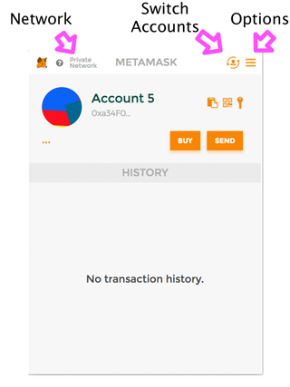

### Walking through of source code

This example modifies [react-redux-starter-kit](https://github.com/davezuko/react-redux-starter-kit) by adding material-ui, changing the topBar and Drawer components, and adding `truffle-solidity-loader` and web3 to the framework. This project is an example of one way to integrate web3 into a slightly non-trivial project.


NOTE (works for truffle 2, not truffle 3):
----
Since completing this post, truffle released their [3.0 update](https://github.com/ConsenSys/truffle/releases/tag/v3.0.2). Decently large changes have been made and this post is only relevant for truffle 2.0. There is a whole [upgrade guide](http://truffleframework.com/tutorials/upgrading-from-truffle-2-to-3).

Who is this for?
----
Someone who is interested in making a dapp with Ethereum. You know javascript, and have a good understanding on how web pages works. You will learn how to integrate Ethereum (web3), Solidity, and redux.


What are we making?
----
I will concentrate on recreating the truffle example app with [react-redux-starter-kit](https://github.com/davezuko/react-redux-starter-kit). The page will show how much MetaCoin a user has, and a form to send coin to others.


Setup
----
For this walkthrough, you need node `^4.5.0` and npm `^3.0.0`. You can also use yarn if you are comfortable with it.

```
git clone git@github.com:sogoiii/web3-react-redux-starter-kit.git <my-project-name>
cd <my-project-name>
git checkout with_truffle_2
npm install testrpc -g
npm start
```
The command `npm start` will setup the project and serve it on `localhost:3000`.

Install [meta mask](https://metamask.io/) chrome extension before continuing. You should see something like below.

 

In a new terminal tab, run `testrpc -l 0x3D0900` to start the mock Ethereum node. This module acts like a node except it returns immediately. The second sets the gas limit. Ignore it for now. After ending the command you should see something like below.


```
Available Accounts
==================
(0) 0xa34f043dd029dd308b29a627e08ded26bd5cda62
(1) 0x03ed28e5dea8dae846c5f2cb73c3fc3b0165f9fe

Private Keys
==================
(0) bd89657396e4e60aaa894a7438bb8336e875e8f56d213e8306e2bb08a0287aa7
(1) 8121526345b0cfc439f6f7e4d8dfcf92efd1bcb1781b6f60d9d28ecf4f6ba107
```

Copy the hash for the `(0)` account, for example `bd89657396e4e60aaa894a7438bb8336e875e8f56d213e8306e2bb08a0287aa7`. Open MetaMask, click the options icon on the top right, and select `import account`. Paste in the private key you just copied. Click the switch accounts icon and select the account you just added. In the example above it would be `0xa34f043dd029dd308b29a627e08ded26bd5cda62`.


Sweet thats it! To recap, you should have one terminal window with `npm start`, a second window with `testrpc -l 0x3D0900`, and a browser with MetaMask installed and configured with the `0` account from testrpc.


Part 1: Adding web3
----
Adding web3 to a project is easy, all you have to do is include it, and configure it with a provider. If a client is using an extension like MetaMask, web3 will be injected into the page. As a developer, you must decide how you want to handle this case. One solution is to check if web3 exists and use it or configure one if none exist. The action `web3Connect` will check for existence and choose its response.

 Look at file `src/store/web3Reducer.js` for my action and reducers. I made a web3 store that saves it state as `{ isConnected, web3 }`.

```javascript
// ------------------------------------
// Constants
// ------------------------------------
import Web3 from 'web3'
import truffleConfig from '../../truffle.js'

// ------------------------------------
// Constants
// ------------------------------------
export const WEB3_CONNECTED = 'WEB3_CONNECTED'
export const WEB3_DISCONNECTED = 'WEB3_DISCONNECTED'

// ------------------------------------
// Actions
// ------------------------------------
export const web3Connect = () => {
  return (dispatch, getState) => {
    /*eslint-disable */
    let web3Location = `http://${truffleConfig.rpc.host}:${truffleConfig.rpc.port}`

    let output = (typeof web3 !== 'undefined') // web3 given by metamask
                  ? { type: WEB3_CONNECTED, payload: { web3: new Web3(web3.currentProvider), isConnected: true } }
                  : { type: WEB3_DISCONNECTED, payload: { web3: null, isConnected: false } }  // comment out for optional section
                  // : { type: WEB3_CONNECTED, payload: { web3: new Web3(new Web3.providers.HttpProvider(web3Location)), isConnected: true } }  // comment in for optional section
    /*eslint-enable */
    dispatch(output)
  }
}

export function web3Connected ({ web3, isConnected }) {
  return {
    type: WEB3_CONNECTED,
    payload: {
      web3,
      isConnected
    }
  }
}

export function web3Disconnected () {
  return {
    type: WEB3_DISCONNECTED,
    payload: {
      web3: null,
      isConnected: false
    }
  }
}

export const actions = {
  web3Connect,
  web3Connected,
  web3Disconnected
}

// ------------------------------------
// Action Handlers
// ------------------------------------
const ACTION_HANDLERS = {
  [WEB3_CONNECTED]: (state, action) => {
    return action.payload
  },
  [WEB3_DISCONNECTED]: (state, action) => {
    return action.payload
  }
}

// ------------------------------------
// Reducer
// ------------------------------------
const initialState = { isConnected: false }
export default function Web3Reducer (state = initialState, action) {
  const handler = ACTION_HANDLERS[action.type]
  return handler ? handler(state, action) : state
}

```

In redux the flow of data is from actions --> reducer --> action handlers. Actions are called from components, which trigger reducers to check their action handlers. When an action dispatches `WEB3_CONNECTED`, the reducer with the action handler of `WEB3_CONNECTED` is called, and the state is updated.


The question becomes, where do we call the action web3Connect? I choose `src/layouts/CoreLayout/CoreLayout.js` as the location. it gets rendered before everything else. There are other places like in the outer most container, or even `main.js`.

If you look above the `render()` function in `src/layouts/CoreLayout/CoreLayout.js`, I call `web3Connect` inside the react `componentWillMount` event function. This allows me to do a rudimentary look at web3 existence before everything is mounted.

```javascript
export class CoreLayout extends Component {
  componentWillMount () {
    this.props.web3Connect() // initiate web3 existence check. metamask compatibility
  }

  render () { ... }
}

CoreLayout.propTypes = {
  children: React.PropTypes.element.isRequired,
  web3Connect: React.PropTypes.func.isRequired //make sure to add proptypes everyone!
}
```

Remember to always add your propTypes, it's free documentation. Open `src/layouts/CoreLayout/index.js` and notice how it imports the `web3Connect` method from our previous file.

```javascript
import CoreLayout from './CoreLayout'
import { connect } from 'react-redux'
import { web3Connect } from '../../store/web3Reducer'

const mapDispatchToProps = {
  web3Connect
}

const mapStateToProps = (state) => ({
})

export default connect(mapStateToProps, mapDispatchToProps)(CoreLayout)
```

Lastly, we need to register/connect web3Reducer with the rest of the reducers. Open `/src/store/reducers` and notice how the web3Reducer is attached to a key called `web3Wrap`.

```javascript
import web3Reducer from './web3Reducer'

export const makeRootReducer = (asyncReducers) => {
  return combineReducers({
    drawerState: MyDrawerReducer,
    topBarState: MyTopBarReducer,
    web3Wrap: web3Reducer,
    metaCoin: MetaCoinReducer,
    location: locationReducer,
    form: formReducer,
    ...asyncReducers
  })
}
```

Now everything is attached. To recap the flow of data. When `CoreLayout` is being rendered, it will call the `web3Connect` function. This function will check if web3 exists and dispatch either a `WEB3_CONNECTED` or `WEB3_DISCONNECTED` action type with its payload. The reducer calls the respective action handler and returns an object to the global variable `web3Wrap`. This means `web3Wrap` with either be `{ web3: null, isConnected: false }` or `{ web3: web3, isConnected: true }`. Open a different browser without metamask and notice how the icon on the top right is different. I left a commented line where if no web3 is found, it will connect to the one configured in `truffle.js`. Maybe someone doesn't want to disable the site and simply have it work all the time. It's up to you.


If you think the above is a little wonky, that is perfectly valid. I'm looking into making either middle-ware module or make a configurable reducer module. I found a [redux-web3](https://www.npmjs.com/package/web3-redux) as an example. Using that is perfectly valid.


Optional part 1:
------
If you want the web client to connect to the local `testrpc` you can uncomment line `21` and comment out line `20` in `src/store/web3Reducer`. It should look like the snippet below. Now if no web3 is detected, we provide it with the one in `truffle.js`

```javascript
import Web3 from 'web3'
import truffleConfig from '../../truffle.js'

// ------------------------------------
// Constants
// ------------------------------------
export const WEB3_CONNECTED = 'WEB3_CONNECTED'
export const WEB3_DISCONNECTED = 'WEB3_DISCONNECTED'

// ------------------------------------
// Actions
// ------------------------------------
export const web3Connect = () => {
  return (dispatch, getState) => {
    /*eslint-disable */
    let web3Location = `http://${truffleConfig.rpc.host}:${truffleConfig.rpc.port}`

    let output = (typeof web3 !== 'undefined') // web3 given by metamask
                  ? { type: WEB3_CONNECTED, payload: { web3: new Web3(web3.currentProvider), isConnected: true } }
                  // : { type: WEB3_DISCONNECTED, payload: { web3: null, isConnected: false } }  // comment out for optional section
                  : { type: WEB3_CONNECTED, payload: { web3: new Web3(new Web3.providers.HttpProvider(web3Location)), isConnected: true } }  // comment in for optional section
    /*eslint-enable */
    dispatch(output)
  }
}

```


Part 2: Adding some logic to existing components to use web3
------

How does the icon on the top right change depending on the state? This is a simple if conditional right! Let's look at some code. Open `src/components/topbar/topBarComponent.js`.

```javascript
... code

render () {
  let { openDrawer, title, web3Wrap } = this.props

  let rightIcon = (web3Wrap.isConnected) ? (<CheckCircle />) : (<CloudOff />) // Hey look a conditional!
  let dialogShown = this.setDialog(web3Wrap.isConnected)
  let rightComponent = (
    <div>
      <FloatingActionButton mini secondary style={rightIndicator} onTouchTap={this.handleOpen}>
        {rightIcon}
        {dialogShown}
      </FloatingActionButton>
    </div>
  )

  return (
    <AppBar
      title={title}
      zDepth={0}
      iconClassNameLeft=''
      onLeftIconButtonTouchTap={() => { openDrawer() }}
      iconElementRight={rightComponent}
    />
  )
}

... code

TopBar.propTypes = {
  openDrawer: React.PropTypes.func.isRequired,
  title: React.PropTypes.string,
  web3Wrap: React.PropTypes.object.isRequired
}
```
The component now expects web3Wrap to be passed into it. The render function checks if `isConnected` is set and chooses between a cloud component or a checkbox component. Naturally, you should ask how web3Wrap gets put into `topBarComponent`. That is done by modifying the `mapStateToProps` function in `src/components/topbar/topbarContainer.js`.

```javascript
const mapStateToProps = (state) => ({
  title: state.topBarState.title,
  web3Wrap: state.web3Wrap,
  balance: state.metaCoin
})
```

That's it! Now when a page has web3 injected via metamask, for example, the top right will show a check-box instead of a cloud-off icon.


Part 3: Webpack and Solidity
----

This section takes a lot from the [truffle documentation](http://truffleframework.com/tutorials/bundling-with-webpack). The work here is just integrating with [react-redux-starter-kit](https://github.com/davezuko/react-redux-starter-kit).

```
npm install truffle -g
truffle init
rm -rf app
npm install truffle-solidity-loader --save-dev
```

The command `truffle init` will set up a truffle application. Because we have a different layout, we remove the app folder. The truffle-solidity-loader works with truffle to generate the necessary javascript files for Solidity contracts. Open `config/webpack.config.js` and on line 199 I added the `truffle-solidity` loader.

```javascript
webpackConfig.module.loaders.push(
  { test: /\.woff(\?.*)?$/,  loader: 'url?prefix=fonts/&name=[path][name].[ext]&limit=10000&mimetype=application/font-woff' },
  { test: /\.woff2(\?.*)?$/, loader: 'url?prefix=fonts/&name=[path][name].[ext]&limit=10000&mimetype=application/font-woff2' },
  { test: /\.otf(\?.*)?$/,   loader: 'file?prefix=fonts/&name=[path][name].[ext]&limit=10000&mimetype=font/opentype' },
  { test: /\.ttf(\?.*)?$/,   loader: 'url?prefix=fonts/&name=[path][name].[ext]&limit=10000&mimetype=application/octet-stream' },
  { test: /\.eot(\?.*)?$/,   loader: 'file?prefix=fonts/&name=[path][name].[ext]' },
  { test: /\.svg(\?.*)?$/,   loader: 'url?prefix=fonts/&name=[path][name].[ext]&limit=10000&mimetype=image/svg+xml' },
  { test: /\.(png|jpg)$/,    loader: 'url?limit=8192' },
  { test: /\.sol/,           loader: 'truffle-solidity' }  // THIS IS THE ONLY NEW LINE
)
```

Then I modified the `truffle.js` and replaced it with the following.

```javascript
module.exports = {
  rpc: {
    host: 'localhost',
    port: 8545,
    gas: 1000000 // Added a gas limit, if you get a no more gas error, try upping this number
  },
  migrations_directory: './migrations'
}
```

When webpack detects a change to a Solidity contract, it will redeploy the contract onto an Ethereum node (`testrpc`) and continue with the build. I did notice a bug where [truffle-solidity-loader](http://truffleframework.com/tutorials/bundling-with-webpack) will run twice. Just ignore that for now.


Part 4: Recreating the send coin example
-----

I want to show how many coins the current account holder has available. The example Solidity contract `contracts/MetaCoin` has a method called getBalance that accepts an address and returns a value in `uint`. Accessing any Solidity method, you need to get a configured and deployed `MetaCoin` object.

I created a small helper function that accepts the getState function, grabs `web3Wrap`, and returns the deployed object of MetaCoin.

```javascript
const getaMetCoin = ({ getState }) => {
  MetaCoin.setProvider(getState().web3Wrap.web3.currentProvider)
  return MetaCoin.deployed()
}
```

We need to set the provider to inform the contract where to access the Ethereum node. You could have contract A talking to `http://contract-a.only.com` and contract B at `http://contract-b.only.com`. Calling `.deployed()` returns the configured contract object with all its methods.

When calling a Solidity contract, you can add a `.call()` to inform the node that it's read-only.

 ```javascript
 export const getBalance = ({ account }) => {
   return (dispatch, getState) => {
     return new Promise((resolve, reject) => {
       let meta = getMetCoin({ getState })
       meta.getBalance.call(account, { from: account })
         .then(function (value) {
           dispatch({
             type: SET_BALANCE,
             payload: { account, value: value.valueOf() }
           })
           resolve()
         }).catch(function (e) {
           console.log(e)
           reject()
         })
     })
   }
 }
 ```

The `getBalance` method accepts an address to check. The `redux-thunk` middleware returns a function with the `dispatch` and `getState`. We wrapped the whole thing in a promise to do our asynchronous actions, because truffle returns promises. We call `getMetaCoin` with `getState` and finally call `meta.getBalance.call(account, {from: account})`. The Solidity contract has 1 input, so why is there a second parameter? Truffle allows you to override some data about the transaction. You do not need to use it, but if you absolutely wanted to &&ancor the from address, you can do so.

Web3 returns ints as a `BigNumber` object. That's why we call `value.valueOf()` to get the string version of the number. Lastly, we create our dispatch object of `SET_BALANCE` type, and resolve. The action didn't update any data, it only fetched it and created the `SET_BALANCE` payload object. The action handler takes in the payload (`{ account, value }` and updates the state.

```javascript
const ACTION_HANDLERS = {
  [SET_BALANCE]: (state, action) => {
    return Object.assign({}, state, action.payload)
  }
}
const initialState = { account: null, value: '0' }
```

Lastly, the metaCoin reducer is attached to the global reducer object in `src/store/reducers` as `metaCoin`.

```javascript
import MetaCoinReducer from '../routes/MetaCoin/modules/metaCoinModule'

export const makeRootReducer = (asyncReducers) => {
  return combineReducers({
    drawerState: MyDrawerReducer,
    topBarState: MyTopBarReducer,
    web3Wrap: web3Reducer,
    metaCoin: MetaCoinReducer, // This is the reducer
    location: locationReducer,
    form: formReducer,
    ...asyncReducers
  })
}
```

By adding the global reducer, we can now share its state with as many components as our hearts desire. Let's open up `src/routes/MetaCoin/containers/CoinCountContainer.js`.

```javascript
import { connect } from 'react-redux'

import CoinCount from '../components/CoinCount'

const mapDispatchToProps = {
}

const mapStateToProps = (state) => ({
  isConnected: state.web3Wrap.isConnected,
  balance: state.metaCoin.value
})

export default connect(mapStateToProps, mapDispatchToProps)(CoinCount)
```

Notice how in `mapStateToProps` the key `balance` is mapped to `state.metaCoin.value`. This should make sense because the reducer from `metaCoin` returns an object in the form of `{ account, value }`. Finally, look at `src/routes/MetaCoin/components/CoinCount.js` and see how balance is being used.

```javascript
export const CoinCount = ({ balance, isConnected }) => {
  balance = (isConnected) ? balance : '¯\\_(ツ)_/¯'
  return (
    <div>
      <span>Your Balance: {balance}</span>
    </div>
  )
}


CoinCount.propTypes = {
  balance: PropTypes.string,
  isConnected: PropTypes.bool
}
```

It's a simple component that renders the value at balance. Easy peasy.


Note: This may have seemed like a lot of work, but I hope that after reading you can see that business logic can be contained in actions. State can be updated in reducers. And then the state can be shared to components via the `mapStateToProps` object declaration. This allows components to be easy object receivers. They don't build state, they don't handle logic. With that said, you can have components do that work if you so desire. Look at `src/components/topBar/topBarComponent.js` for an example of that.


Conclusion:
----

After doing all this work, you should be able to understand the redux data flow. You should be able to add pages, inject web3, and create actions linked to your own Solidity contracts. That is one tall order, I should say. There are few things missing, like client testing and Solidity testing. Maybe for another day.
